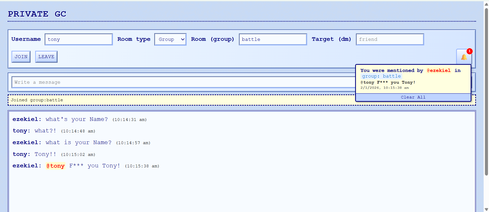

# 🕵️‍♂️ Socket ChatApp

### *Because what happens in the group chat, stays in the group chat.*

Socket ChatApp was built as a fun side project to chat privately with a group of friends at work — for the kind of conversations that don’t really fit on Teams or Slack.

The goal wasn’t to build another enterprise messaging tool, but something simple, private, and fast, inspired by early internet forum and chat sites.

Think late-90s aesthetics, modern sockets, and just enough features to get the job done.

---

## ✨ Features

* **⚡ Real-time Magic**: Powered by WebSockets for instant gratification. No refreshing required!
* **👥 Group Hangouts**: Create or join rooms. Perfect for your squad, your team, or your niche hobby group.
* **🤫 Secret DMs**: One-on-one private messaging because some things aren't for the group chat.
* **📣 "Hey You!" Mentions**: Tag your friends with `@username` to make sure they see your message.
* **🔔 Never Miss a Beat**: Real-time notifications for mentions and new messages.

---

## 🛠️ The Tech Stack

| Component | Technology | Why we love it |
| --- | --- | --- |
| **Backend** | Python / Flask | Fast, flexible, and fun. |
| **Real-time** | Flask-SocketIO | The magic engine behind the instant chat. |
| **Database** | SQLAlchemy / SQLite | Reliable data storage for all your memories. |
| **Frontend** | HTML5 / CSS3 / JS | Retro 90s vibes meets modern ES6+ logic. |

---

## 📦 Getting Started

Ready to jump in? Follow these steps and you'll be chatting in no time.

### 1. Grab the Code

```bash
git clone https://github.com/chiragx16/Socket_ChatApp.git
cd Socket_ChatApp

```

### 2. Set Up Your Space

Create a virtual environment to keep things tidy:

```bash
python -m venv venv
```

### 3. Load the Goods

Install the necessary dependencies:

```bash
pip install -r requirements.txt

```

### 4. Configure Your Vibe

Copy the template and add your secret sauce:

```bash
cp .env.example .env
# Open .env and add your SECRET_KEY!

```

---

## 🚀 Running the App

### **Development Mode**

Launch the engine with a single command:

```bash
python app.py

```

Fire up your browser and head to `http://localhost:7812`.

> **Pro Tip:** If you want that extra layer of security, run `python generate_certi.py` first to enable HTTPS!

---

## 📡 Networking & The "Notification" Catch

The app is configured to run on `0.0.0.0`, meaning it broadcasts to your local machine **and** anyone on your same Wi-Fi/Office network.

Example:
When you launch the app, you’ll see something like this

* **Local:** `http://127.0.0.1:7812`
* **Network:** `http://<your-local-LAN-IP>:7812` (Your friends use this one!)

### 🔐 The SSL Requirement

Modern browsers are strict! To use **Windows Desktop Notifications**, the browser requires a **Secure Context (HTTPS)**.

* **Option A: Full Experience (With Notifications)** You must generate a certificate and enable SSL in `app.py`.
```python
# Generate your certi first: python generate_certi.py
ssl_context = ('cert.pem', 'key.pem')
socketio.run(app, host="0.0.0.0", port=port, debug=True, ssl_context=ssl_context)

```


* **Option B: Simple Mode (No Notifications)**
If you don't need pop-up alerts, just run standard HTTP:
```python
socketio.run(app, host="0.0.0.0", port=port, debug=True)

```

---

## API Endpoints

### REST API

- `GET /` - Main chat interface
- `GET /api/messages` - Retrieve chat messages
- `GET /api/room_users` - Get users in a room
- `GET /api/notifications` - Get user notifications
- `POST /api/notifications/read` - Mark notifications as read

### WebSocket Events

#### Client → Server
- `connect` - Establish connection
- `register` - Register username
- `join_room` - Join a chat room
- `leave_room` - Leave a chat room
- `send_message` - Send a message
- `mark_read` - Mark messages as read
- `disconnect` - Close connection

#### Server → Client
- `connected` - Connection established
- `registered` - Username registered
- `room_joined` - Successfully joined room
- `room_left` - Successfully left room
- `message` - New message received
- `room_users_update` - Room user list updated
- `mention_notification` - User mentioned notification
- `notification_update` - Notification count update
- `read_receipt` - Messages marked as read
- `error` - Error message

---

## 🤝 Contributing

Got a cool idea for a new retro feature? We'd love to see it!

1. **Fork** the repo.
2. Create a **Feature Branch**.
3. **Commit** your magic.
4. Open a **Pull Request**.